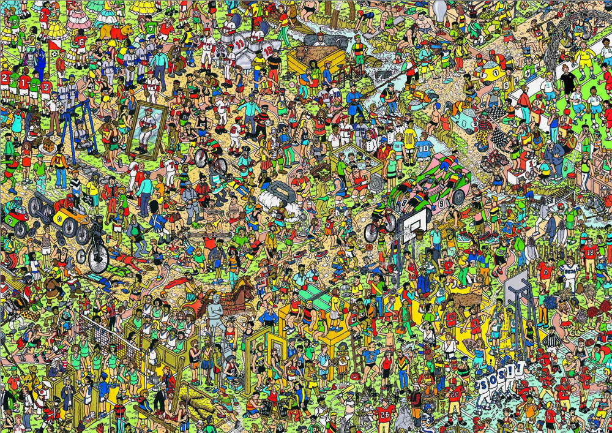
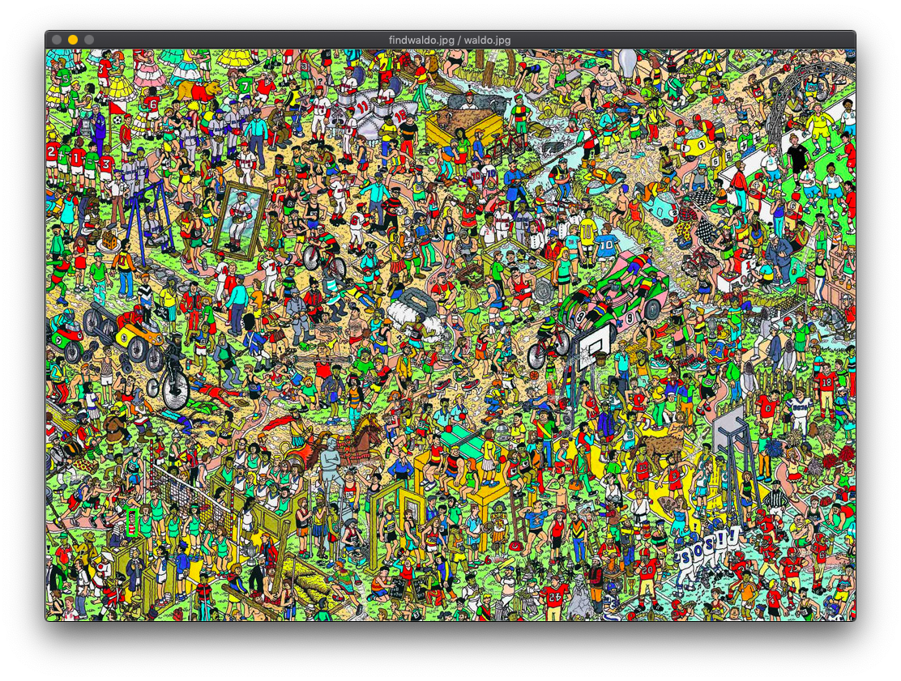
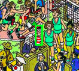

# Match
A Node.js library (or cli tool) to match something on image.
# Demo:
* Original Image:

* Find this

* Output Window


# Usage:
* CLI :
```console
# install lib
$ npm i -g matchimg
# or yarn
# yarn global add matchimg
# then 
$ matchimg
Match> 
```
* Node.js: 
```javascript
// For exmaple:
const Match = require("matchimg");
// ASync Function that returns cv:
Match("findwaldo.jpg", "waldo.jpg").then((cv)=>{
    // Wait for key
    cv.waitKey();
    // And Exit
    process.exit(0);
});
```